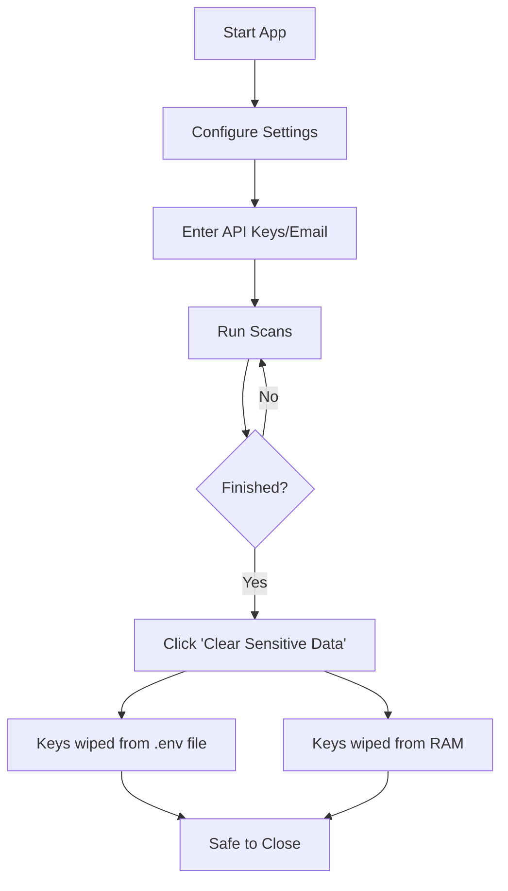

# File Integrity Checker

A robust, cross-platform file integrity monitoring tool with a responsive GUI, background scanning, automated SQL storage, and email alerts. Now supports Windows, macOS, and Linux.

## Features

- **✅ File Hash Verification**: Uses SHA-256 to detect any changes to your files.
- **🚀 Background Scanning**: Scans large folders in the background without freezing the UI. Includes a real-time progress bar.
- **🖥️ Cross-Platform**: Fully compatible with Windows, macOS, and Linux.
- **📧 Email Alerts**: Receive instant notifications when a file is modified or missing. Includes a "Test Connection" button to verify settings.
- **🔍 VirusTotal Integration**: Automatically checks new or modified files against the VirusTotal database for malware.
- **🔒 Security & Privacy**: "Clear Sensitive Data" wipes API keys and credentials from both the configuration file `.env` and system memory immediately.
- **📂 Bulk Scanning**: Smart batch processing with directory-level exclusion patterns to skip noise (`.git`, `node_modules`, `*.pyc`, etc.).
- **📊 Scan History Viewer**: Built-in color-coded table showing every scanned file's status, hash, and timestamp — with live search and one-click CSV export.
- **🔐 Lock Baseline**: Accept the current state of modified files as the new trusted baseline with a single click — a feature found only in enterprise tools like Tripwire.
- **🎨 Modern Dark UI**: Clean dark theme with a polished stylesheet, making it easy to use on any machine.

---

## Installation

1. **Clone the repository:**
   ```bash
   git clone https://github.com/mmcyberus/IntegrityChecker.git
   cd IntegrityChecker
   ```

2. **Install Dependencies** (requires Python 3.8+):
   ```bash
   pip install -r requirements.txt
   ```

3. **Run the Application:**
   ```bash
   python integritychecker.py
   ```

---

## Usage Guide

### 1. Scanning Files & Folders
- **Scan File**: Check a single file for changes.
- **Scan Folder**: Recursively scan an entire directory.
    - *Note*: You can **Cancel** a scan at any time if it takes too long.
    - A summary dialog will appear after the scan completes, showing the number of New, Modified, Secure, and Missing files.

### 2. Configuration & Alerts
- Click **"Configure Settings"** to set up:
    - **VirusTotal API Key**: For malware scanning.
    - **Email Settings**: SMTP server details to receive alerts.
    - **Test Email**: Click "Test Email Connection" to verify your settings work.
    - **Exclude Patterns**: Comma-separated glob patterns to skip during folder scans (e.g. `.git, *.pyc, node_modules`). Excluded directories are pruned at the root level for maximum performance.

### 3. Lock Baseline
- Click **"Lock Baseline"** and select a folder to accept the current state of all **Modified** files as the new trusted baseline.
- Useful after intentional updates — marks verified changes as Secure so future scans only flag genuinely unexpected modifications.

### 4. Viewing Scan History
- Click **"View Scan History"** to open a built-in color-coded table showing every scanned file:
    - 🟢 **Secure** — file matches its trusted hash
    - 🔵 **New** — file seen for the first time
    - 🟡 **Modified** — file hash has changed since last scan
    - 🔴 **Missing** — file was previously tracked but not found
    - Use the **Filter** box to search by path or status, and **Export CSV** to save results for reporting.

### 5. Security Cleanup
- Click **"Clear Sensitive Data"** to securely remove all API keys and passwords from the `.env` file and memory. Use this before closing the app on a shared machine.

---

## Security Workflow



### Best Practices
- **Memory Cleanup**: Clicking "Clear Sensitive Data" removes credentials from the `.env` file and the process environment. Note that Python string objects may linger in memory until the next garbage-collection cycle.
- **File Permissions**: For extra security on shared machines (Linux/macOS), you can lock the configuration file after setup:
  ```bash
  chmod 600 .env
  ```

---

## Creating an Executable

To bundle the application into a single standalone executable:

```bash
# Windows / macOS / Linux
pyinstaller --onefile --windowed integritychecker.py
```
*Note: The executable will be found in the `dist` folder.*

---

## Project Structure

```
IntegrityChecker/
├── integritychecker.py        # Main Application (GUI, Logic, Database)
├── requirements.txt           # Dependencies
├── README.md                  # Documentation
├── LICENSE                    # MIT License
├── .github/
│   └── workflows/
│       └── lint.yml           # GitHub Actions CI (flake8)
├── .env                       # Config (created automatically, owner-read-only)
├── integrity.log              # Rotating log (5 MB max, 3 backups)
└── file_integrity.db          # SQLite database
```

## License
This project is licensed under the [MIT License](LICENSE).
