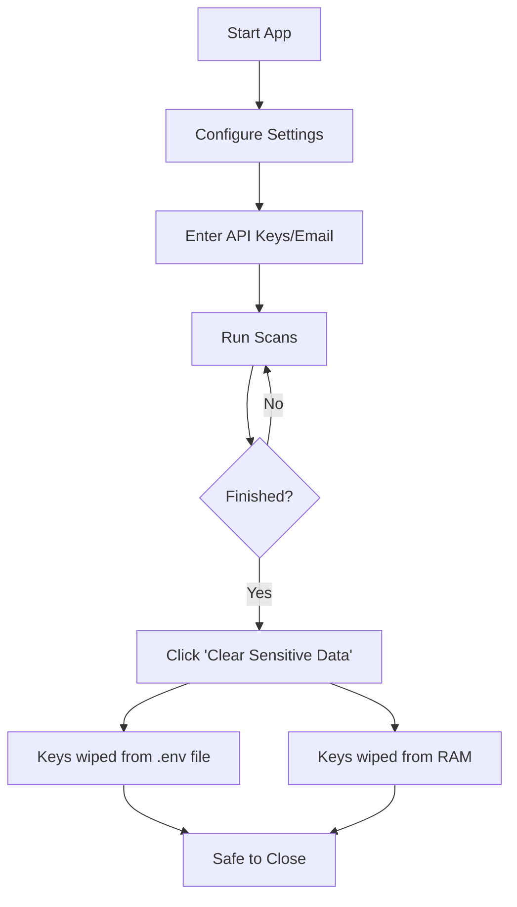

# File Integrity Checker

A robust, cross-platform file integrity monitoring tool with a responsive GUI, background scanning, automated SQL storage, and email alerts. Now supports Windows, macOS, and Linux.

## Features

- **✅ File Hash Verification**: Uses SHA-256 to detect any changes to your files.
- **🚀 Background Scanning**: Scans large folders in the background without freezing the UI. Includes a real-time progress bar.
- **🖥️ Cross-Platform**: Fully compatible with Windows, macOS, and Linux.
- **📧 Email Alerts**: Receive instant notifications when a file is modified or missing. Includes a "Test Connection" button to verify settings.
- **🔍 VirusTotal Integration**: automatically checks new or modified files against the VirusTotal database for malware.
- **🔒 Security & Privacy**: "Clear Sensitive Data" wipes API keys and credentials from both the configuration file `.env` and system memory immediately.
- **📂 Bulk Scanning**: Smart batch processing for high performance on large directories.

---

## Installation

1. **Clone the repository:**
   ```bash
   git clone https://github.com/mmcyberus/IntegrityChecker.git
   cd IntegrityChecker
   ```

2. **Install Dependencies:**
   ```bash
   pip install -r requirements.txt
   ```

3. **Run the Application:**
   ```bash
   python integritychecker.py
   ```

---

## Usage Guide

### 1. scanning Files & Folders
- **Scan File**: Check a single file for changes.
- **Scan Folder**: recursively scan an entire directory.
    - *Note*: You can **Cancel** a scan at any time if it takes too long.
    - A summary dialog will appear after the scan completes, showing the number of New, Modified, Secure, and Missing files.

### 2. Configuration & Alerts
- Click **"Configure Settings"** to set up:
    - **VirusTotal API Key**: For malware scanning.
    - **Email Settings**: SMTP server details to receive alerts.
    - **Test Email**: Click "Test Email Connection" to verify your settings work.

### 3. Viewing History
- Click **"View Scan History"** to open the `integrity.log` file in your system's default text editor.

### 4. Security Cleanup
- Click **"Clear Sensitive Data"** to securely remove all API keys and passwords from the `.env` file and memory. Use this before closing the app on a shared machine.

---

## Security Workflow



### Best Practices
- **Memory Cleanup**: The application now supports **True Cleanup**. Clicking "Clear Sensitive Data" removes credentials from both the file and the running process memory.
- **File Permissions**: For extra security on shared machines (Linux/macOS), you can lock the configuration file after setup:
  ```bash
  chmod 600 .env
  ```

---

## Creating an Executable

To bundle the application into a single standalone executable:

```bash
# Windows / macOS / Linux
pyinstaller --onefile --windowed integritychecker.py
```
*Note: The executable will be found in the `dist` folder.*

---

## Project Structure

```
IntegrityChecker/
├── integritychecker.py   # Main Application (GUI, Logic, Database)
├── requirements.txt      # Dependencies
├── README.md             # Documentation
├── .env                  # Config (created automatically)
├── integrity.log         # Logs
└── file_integrity.db     # Database
```

## License
Open Source.
